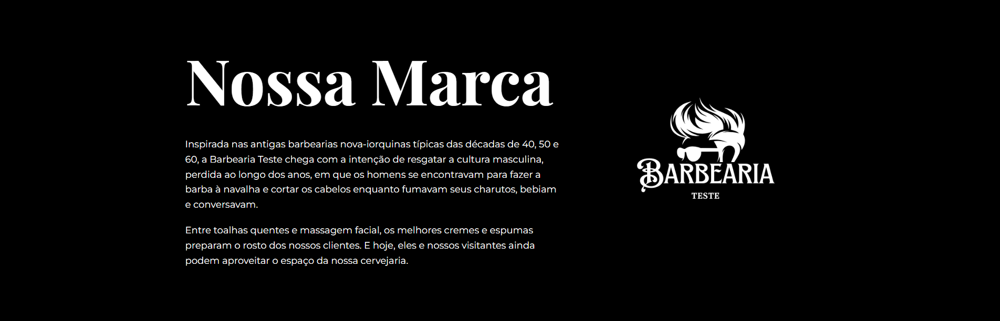
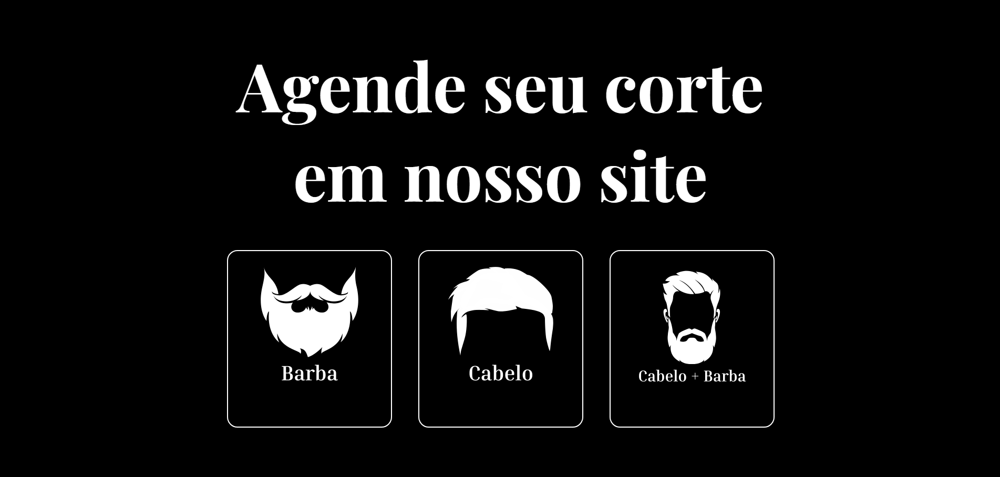
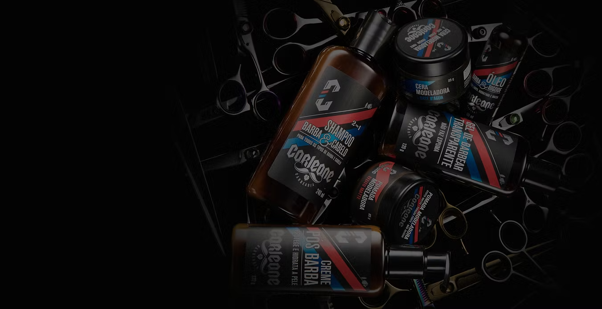
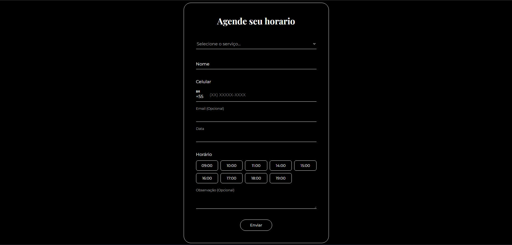

<div align="center">
  <h1>✂️ Barber Shop Premium Experience</h1>
  
  <p>
    Plataforma web para gestão de marca e agendamento de serviços de barbearia.
    Projeto acadêmico desenvolvido no curso de <b>Ciência da Computação (Unifran)</b>.
  </p>

  
  
  
  <br><br>

  <a href="https://ederjuniors.github.io/Barbearia/">
    
  </a>
</div>

<br>

<div align="center">
  
</div>

<br>

## 📋 Contexto de Negócio

Este projeto foi concebido como uma **Solução Digital Completa** para modernizar o atendimento de uma barbearia tradicional. O desafio proposto na disciplina de Desenvolvimento Web da **Unifran** foi criar uma interface que não apenas apresentasse a marca, mas facilitasse a conversão de visitantes em clientes.

A aplicação foca em uma estética "Premium" (Dark & Gold), transmitindo autoridade e sofisticação, essenciais para o público-alvo do estabelecimento.

## 🚀 Funcionalidades & UX

- **Sistema de Agendamento (Front-end):** Formulário interativo para captura de leads, permitindo seleção de serviço (Cabelo/Barba), data e horário específico.
- **Vitrine de Produtos:** Seção dedicada ao merchandising (Produtos Corleone), expandindo o potencial de receita do negócio além dos serviços.
- **Integração de Localização:** Mapa interativo e dados de contato estrategicamente posicionados para facilitar a visita física.
- **Design Responsivo:** Layout fluido que se adapta perfeitamente a smartphones, permitindo agendamentos rápidos "on-the-go".

## 📸 Galeria do Projeto

<div align="center">
  
  
  
</div>

## 🛠️ Stack Tecnológica

-  **Semântica de Negócio:** Uso de `forms`, `sections` e `footer` estruturados.
-  **Estilo Premium:**
    - **Typography:** Uso de fontes com serifa para títulos e sans-serif para leitura.
    - **Color Palette:** Contraste alto (Preto/Branco) com acentos em Dourado/Marrom.
    - **Flexbox & Grid:** Alinhamento de cards de serviços e produtos.
-  **Interatividade:**
    - Validação de campos do formulário.
    - Máscara de input para telefone/celular.

## 📂 Estrutura do Projeto

```bash
/
├── assets/
│   ├── css/
│   │   └── style.css    # Estilos globais
│   ├── img/             # Imagens otimizadas
│   └── js/
│       └── script.js    # Lógica de validação
├── index.html           # Landing Page
└── README.md            # Documentação
```

## 🏁 Como Executar Localmente
Clone o repositório:

```bash
git clone https://github.com/EderJuniorS/Barbearia.git
```

Abra o arquivo index.html no seu navegador.

<div align="center"> Desenvolvido por <a href="https://www.linkedin.com/in/ederjuniormatossilva">Éder Junior</a> | Ciência da Computação @ Unifran </div>
